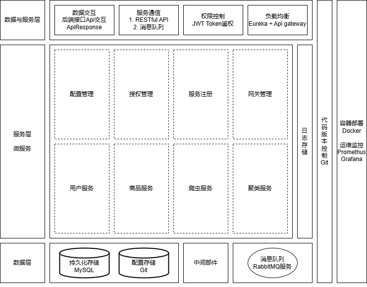

# 项目设计文档

> 3220105105 宋瑞泽

## 1. 项目概述

### 1.1 背景

随着电子商务的发展，用户在不同平台上购买商品时面临着价格对比的问题。不同平台的商品价格差异可能较大，且更新频繁，给用户带来选择困难。为了帮助用户便捷地比较各大平台的价格，及时获取优惠信息，迅速查询历史价格，本项目旨在开发一个价格比较网站，提供一个便捷的方式来查询商品的实时价格，并支持跨平台多时域的价格对比。

### 1.2 目标

本项目的目标是开发一个高效的价格比较平台，具备以下核心功能：
- **商品价格比较**：支持从多个主流电商平台获取商品价格并进行实时对比。
- **商品信息查询**：用户可以通过输入商品名称或使用图片/条形码进行查询，获取详细的商品信息和历史价格。
- **价格历史图表**：展示商品的价格变化趋势，帮助用户做出理性购买决策。
- **价格提醒**：用户可以设置价格提醒，当商品价格下降到指定值时，系统通过邮件或推送通知用户。
- **移动端支持**：网站具备响应式设计，确保用户在移动设备上的流畅体验。
- **高效的爬虫系统**：支持定时抓取用户收藏商品的价格信息，保持价格数据的更新和准确。
- **商品相似度聚类**：基于商品多维度相似度，通过聚类算法自动识别和合并来自不同平台的相似商品，确保价格比较的准确性和完整性。

## 2. 功能需求

### 2.1 用户服务

- 用户注册：用户可以通过邮箱注册账户，系统会发送一封验证邮件到用户邮箱，用户需要验证邮箱后才能登录。
- 登录：用户可以通过用户名和密码，或通过手机验证登录系统。
- 修改密码：用户可以通过旧密码修改为新密码，可以通过邮箱或手机号重置密码。
- 用户信息管理：用户可以修改个人信息，包括用户名、邮箱、手机号等。
- 用户收藏：用户可以收藏商品，系统会记录用户的收藏记录，并提供收藏商品列表，用户可以设置收藏商品的价格推送提醒。 
- 价格推送：用户可以设置价格提醒策略，包括越过价格警戒线时提醒、进入/离开价格区间时提醒、短期价格符合特定趋势时提醒和价格波动时提醒等。

### 2.2 商品查询服务

- 商品多属性查询：用户可以通过商品名称、价格区间等多个查询参数进行商品查询，系统会根据查询参数在多个电商平台进行搜索，返回匹配的商品列表。
- 商品历史价格查询：用户可以通过商品链接或商品属性查询商品的历史价格，系统会根据链接或属性获取商品的历史价格，给出可视化呈现。
- 商品价格实时监控：用户可以设置商品价格提醒，系统会根据用户设置的提醒策略，实时查询商品价格，发送邮件或推送通知。

### 2.3 商品展示服务

- 商品信息展示：用户可以查看商品的详细信息，包括商品名称、价格、描述等。
- 相似商品合并：系统会根据商品类型自动识别和合并来自不同平台的相似商品，确保价格比较的准确性和完整性。
- 商品价格趋势分析：用户可以查看商品的价格趋势，包括价格趋势图、平均价格、最大最小值等。

### 2.4 手机端适配需求

- 支持移动端浏览和操作。

### 2.5 安全需求

- 用户身份认证：使用JWT实现用户身份认证。用户和微服务需在后续请求中携带此token进行身份验证。
- 用户权限管理与访问控制：根据用户角色控制对不同接口的访问权限。系统使用RBAC模型确保只有具有相应角色的用户才能访问对应接口。
- 密钥管理与存储：使用多种加密算法对敏感数据进行加密存储。
- 异常处理与错误响应：系统通过统一的错误处理机制捕获并处理认证、权限、请求等异常，向客户端返回适当的错误信息。不向客户端暴露过多的内部错误细节，避免泄露系统内部信息。
- 安全审计与日志记录：系统记录所有重要操作的日志，包括用户登录、数据修改等。系统记录所有用户的访问行为，包括访问时间、请求接口、响应状态等，便于追溯和分析。
- 攻击防护措施：
  - **防止暴力破解**：通过限制登录尝试次数、加密存储用户密码（如 bcrypt）以及采用 CAPTCHA 验证来防止暴力破解攻击。
  - **CSRF防护**：启用 CSRF 防护机制，确保用户操作请求来源可信。
  - **XSS防护**：对用户输入的内容进行严格的验证与转义，避免跨站脚本攻击。
  - **SQL 注入防护**：通过使用 ORM 框架（如 Hibernate）以及参数化查询，防止 SQL 注入攻击。

## 3. 系统架构概述

### 3.1 技术栈说明

* **开发与构建工具**：Java 21 with Spring Boot in Maven
* **商品相似度聚类**：HanLP, to_be_filled
* **服务注册与发现**：Eureka Server  
* **配置管理**：Spring Cloud Config  
* **服务间通信**：REST API (Spring MVC), RabbitMQ  
* **API 网关**：Spring Cloud Gateway  
* **监控与管理**：Spring Boot Actuator, Prometheus, Grafana  
* **安全与认证**：Spring Security, JWT  
* **数据库**：MySQL  
* **前端**：Vue.js, Axios  
* **容器化**：Docker  

### 3.2 数据模型

**用户模型(User)**

| 字段名称      | 数据类型   | 说明                         |
|:-------------|:---------|:----------------------------|
| `user_id`    | INT      | 用户唯一标识符，主键，自动递增     |
| `username`   | VARCHAR  | 用户名，唯一                   |
| `password`   | VARCHAR  | 用户密码（加密存储）            |
| `email`      | VARCHAR  | 用户邮箱，唯一                  |
| `phone`      | VARCHAR  | 用户电话，唯一               |
| `role`       | VARCHAR  | 用户角色，默认为普通用户          |
| `created_at` | DATETIME | 用户注册时间                    |
| `updated_at` | DATETIME | 用户信息更新时间                 |

**商品模型(Item)**

| 字段名称          | 数据类型   | 说明                         |
|:-----------------|:---------|:----------------------------|
| `item_id`     | INT      | 商品唯一标识符，主键，自动递增     |
| `name`           | VARCHAR  | 商品名称                     |
| `category_id`    | INT      | 商品类别，外键关联类别表          |
| `price`          | DECIMAL  | 商品当前价格                     |
| `url`    | VARCHAR   | 商品链接                     |
| `image`      | VARCHAR  | 商品图片链接                   |
| `platform`       | VARCHAR  | 商品所属电商平台                |
| `created_at`     | DATETIME | 商品添加时间                   |
| `updated_at`     | DATETIME | 商品信息更新时间                |

**类别模型(Category)**

| 字段名称      | 数据类型   | 说明                         |
|:-------------|:---------|:----------------------------|
| `category_id` | INT      | 类别唯一标识符，主键，自动递增     |
| `name`        | VARCHAR  | 类别名称                      |
| `parent_id`   | INT      | 父类别ID，支持多级类别结构         |
| `created_at`  | DATETIME | 类别创建时间                    |
| `updated_at`  | DATETIME | 类别信息更新时间                 |

**价格历史模型(PriceHistory)**

| 字段名称       | 数据类型   | 说明                              |
|:--------------|:---------|:---------------------------------|
| `history_id`  | INT      | 历史记录唯一标识符，主键，自动递增       |
| `product_id`  | INT      | 商品ID，外键关联商品表                  |
| `price`       | DECIMAL  | 商品当时的价格                        |
| `timestamp`   | DATETIME | 记录价格变动的时间                     |

**收藏夹模型(Favorite)**

| 字段名称       | 数据类型   | 说明                           |
|:--------------|:---------|:--------------------------------|
| `favorite_id` | INT      | 收藏夹唯一标识符，主键，自动递增       |
| `user_id`     | INT      | 用户ID，外键关联用户表                |
| `product_id`  | INT      | 商品ID，外键关联商品表                |
| `alert_type` | VARCHAR  | 商品提醒类型，如价格低于设定值、价格高于设定值等|
| `created_at`  | DATETIME | 商品添加到收藏夹的时间                |

### 3.3 后端架构

后端采用微服务架构，每个功能模块都作为一个独立的服务运行，通过Spring Cloud系列组件实现服务的注册与发现、配置管理、负载均衡、服务间通信、监控与安全认证等功能。每个微服务通过REST API和消息队列进行通信，服务之间解耦，具有高扩展性和可维护性。

#### 3.3.1 后端服务架构图

  

#### 3.3.2 后端微服务模块

**1. main-service：API网关**
- 作为客户端和微服务之间的中介，API网关处理外部请求并将其路由到相应的后端服务。它还提供负载均衡、安全认证、限流和请求过滤等功能。
- 支持请求转发、跨域请求处理、路径重写等。

**2. Eureka-server：服务注册中心**
- 使用Eureka Server作为服务注册与发现机制。各个微服务在启动时注册到Eureka Server，其他服务通过Eureka查询可用服务进行调用。
- 支持动态服务注册和服务健康检查，保证服务可用性。

**3. config-server：配置中心**
- 使用Spring Cloud Config集中管理各个微服务的配置。配置存储在Git仓库中，所有服务在启动时加载配置，支持配置动态刷新。
- 支持统一的版本控制和管理，确保配置一致性。

**4. auth-service：认证服务**
- 作为客户端请求的总认证入口，负责对所有用户请求进行身份验证和授权管理。它确保用户的身份合法性，并为后续请求提供必要的访问权限。
- 使用Spring Security进行用户认证和授权，并利用JWT实现无状态的认证机制，简化用户的登录状态管理。

**5. user-service：用户服务**
- 负责用户的基本信息管理，包括注册、登录、个人资料更新等功能。
- 通过Spring Security和JWT实现用户认证和授权，确保用户信息的安全性。

**6. item-service：商品服务**
- 负责商品和商品品类相关的CRUD操作，包括商品信息的查询、创建、更新和删除；商品品类的创建、更新和删除；商品历史价格的获取，更新等功能。
- 通过Spring Security和JWT实现访问控制。

**7. spider-service：爬虫服务**
- 用于抓取商品信息，包括商品名称、价格、图片等。
- 提供商品数据抓取接口，供其他服务调用。

**8. cluster-service：聚类服务**
- 用于商品数据的聚类分析，以识别并合并相似。
- 提供商品分析接口，供其他服务调用。

**9. monitor-service: 监控服务**
- 负责整个微服务架构的监控与健康检查，实时跟踪各个微服务的状态、性能指标和日志信息。
- 提供系统运行状况的实时监控，包括CPU使用率、内存使用、磁盘空间、网络流量、响应时间等重要指标。
- 集成日志收集系统，统一汇总各个微服务的日志，支持报警机制。

#### 3.3.3 后端微服务交互

**1. 同步通信：RESTful API**
- 各个微服务通过 **REST API** 进行同步通信，API网关 (main-service) 作为外部请求的入口，路由请求到各个微服务。每个微服务都提供一组 HTTP 接口，客户端可以通过标准的 HTTP 方法（如 GET、POST、PUT、DELETE）与后端服务进行交互。
- **API调用流程**：
  - 客户端请求通过 API 网关传递到相关微服务（如用户信息通过 `user-service`，商品信息通过 `item-service`）。
  - 服务通过 REST API 返回数据或处理请求。例如，商品数据的查询可以通过 `item-service` 的接口进行，用户数据的验证和获取可以通过 `user-service` 实现。
  - 每个微服务都会进行身份验证和权限检查（通过 JWT 和 Spring Security），确保请求的合法性。

**2. 异步通信：消息队列 (RabbitMQ)**
- 微服务之间的某些操作是异步的，例如商品信息的爬取（通过 `spider-service`）和商品的聚类分析（通过 `cluster-service`）。
- 这些服务通过 **RabbitMQ** 等消息队列进行异步消息的传递：
  - `spider-service` 将抓取到的商品数据以消息的形式发送到消息队列。
  - `cluster-service` 监听该队列，从中获取商品信息并进行聚类处理。
  - 聚类结果处理完成后，`cluster-service` 将聚类数据发送回其他相关服务，或者通过消息队列发送给 `item-service` 进行更新。

### 3.4 前端架构

前端架构采用了现代化的单页应用（SPA）模式，使用 Vue.js 框架构建，配合 Axios 实现与后端微服务的通信。以下是前端架构的详细说明：

#### 1. **技术栈**
- **前端框架**：Vue.js 3
- **状态管理**：Vuex
- **路由管理**：Vue Router
- **HTTP 请求库**：Axios
- **UI 组件库**：Element Plus
- **构建工具**：Vite
- **代码风格**：ESLint + Prettier
- **样式方案**：SCSS

#### 2. **前端模块划分**

前端项目根据功能模块划分为多个子模块，主要包括：

1. **首页模块**：
   - 主要展示用户的首页内容，如推荐商品、热门商品、广告等。
   - 用户可以通过首页直接进行商品搜索和查看。
   - 首页与 `item-service` 进行通信，获取商品列表、商品详情、推荐商品等数据。

2. **用户认证模块**：
   - 用户通过登录、注册页面进行认证操作。
   - 该模块与 `auth-service` 进行交互，负责获取和验证 JWT Token。
   - 支持用户登录、注册、密码重置等功能，并将认证信息保存在 Vuex 中。

3. **商品搜索与浏览模块**：
   - 用户可以通过商品名称、类别、价格区间等筛选条件进行商品搜索。
   - 支持多条件筛选、排序和分页显示商品。
   - 该模块与 `item-service` 和 `spider-service` 进行通信，获取商品信息和价格更新。

4. **商品详情与比较模块**：
   - 用户可以查看商品的详细信息，如名称、价格、图片、规格等。
   - 支持多平台价格比较，用户可以查看同一商品在不同平台的价格。
   - 该模块与 `item-service`、`spider-service` 和 `cluster-service` 进行交互，获取商品详情和价格历史数据。

5. **用户中心模块**：
   - 用户可以查看和管理自己的个人信息、订单历史、收藏夹等。
   - 该模块与 `user-service` 进行交互，获取和更新用户的个人数据。

6. **价格提醒与推送模块**：
   - 用户可以设置价格提醒，系统会在商品价格下降时推送通知。
   - 与 `item-service` 和 `monitor-service` 进行通信，获取商品的价格变化信息。

7. **历史记录与分析模块**：
   - 用户可以查看历史的商品价格趋势图，并获取相关的价格变动分析。
   - 与 `item-service` 进行交互，展示商品的历史价格数据。

#### 3. **前端与后端微服务的交互**
前端通过以下几种方式与后端微服务进行交互：

- **HTTP 请求**：
  - 前端通过 Axios 发起 HTTP 请求，调用后端的 RESTful API。
  - 各个微服务通过 API 网关（`main-service`）进行访问，确保请求路由到正确的服务。

- **JWT 身份验证**：
  - 用户登录后，前端将 JWT 存储在浏览器的 localStorage 或 sessionStorage 中。
  - 在每次 API 请求时，前端将 JWT 作为 Authorization 请求头的一部分传递给后端，进行用户身份验证。

- **商品数据加载与更新**：
  - 在用户进行商品搜索时，前端将请求发送到 `item-service`，后端返回商品数据，前端展示商品列表。
  - 对于实时更新的数据（如价格变动），前端会定期向 `spider-service` 或 `monitor-service` 发起请求，获取最新的数据。

- **消息推送与通知**：
  - 前端通过 WebSocket 或轮询方式，接收来自后端的价格提醒和推送通知。
  - 当用户设置的商品价格变化时，后端通过 WebSocket 通知前端，前端实时更新页面。

#### 4. **前端功能与页面流**

详细介绍见整体报告中的页面设计
